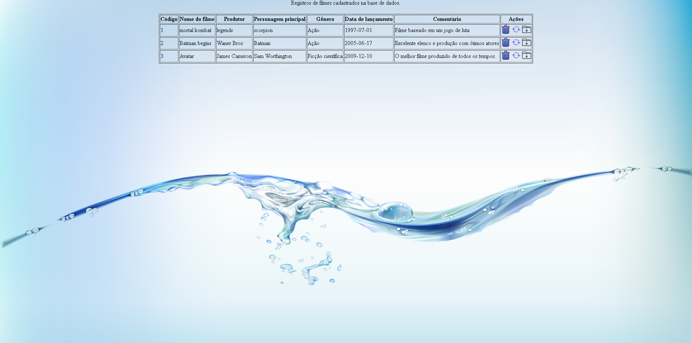
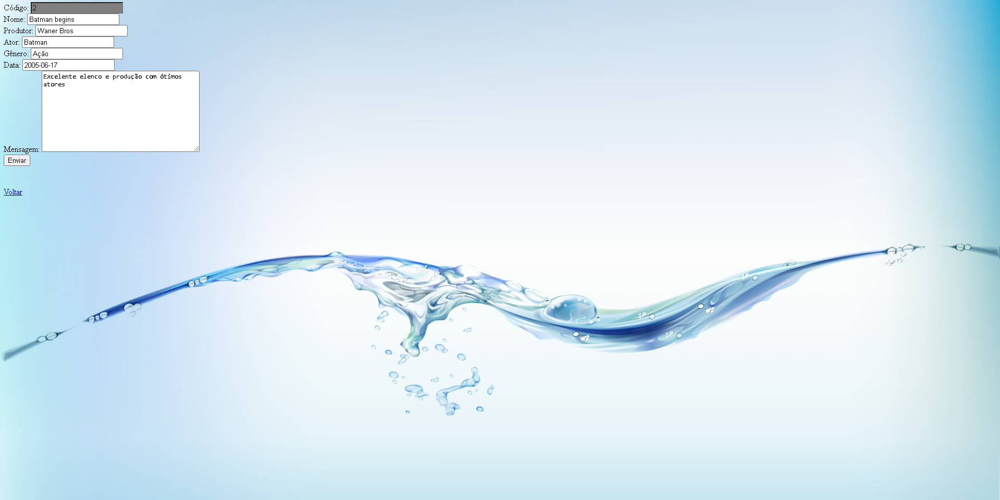

  <b><h1>Site para cadastro de filmes</h1></b>
  

##

  <b><h1>💡 Sobre</h1></b>

Site para cadastro de filmes para testar e fixar o conhecimento visto em aulas de programação web criando um crudtxt.

##

  <b><h1>📊 Status do projeto</h1></b>

  <b>🏆 Finalizado 🏆</b>

##

  <b><h1>🎯 Tarefas</h1></b>

Clique para visualizar as tarefas feitas

|      Estado      |     Plataforma   |                 Tarefa                |
|      :---:       |       :---:      |                  :---:                |
|:heavy_check_mark:|:computer:        |CrudTXT|
|:heavy_check_mark:|:computer:        |Inserir registro |
|:heavy_check_mark:|:computer:        |Deletar registro  |
|:heavy_check_mark:|:computer:        |Atualizar registro |

##

  <b><h1>Resultados</h1></b>

  

# Tela de cadastro
  

# Tela de registros

# Tela de atualizar registros

##

  <b><h1>💻 Download</h1></b>

Para fazer uso desse repositório e dos códigos, você pode cloná-lo em seu GitHub com a opção de fork ou clique em [`baixar`](https://github.com/RamonCintas/Site-de-cadastro-de-Filmes/archive/refs/heads/main.zip) esse repositório.

##

  <b><h1>⚔️ Tecnologias</h1></b>

As seguintes ferramentas foram utilizadas para desenvolver esse repositório:

|Ferramentas|
|:-:|
|[Sistema Windows](https://www.microsoft.com/pt-br/windows)|
|[PHP](https://www.php.net/)|
|[HTML](https://www.w3schools.com/html/)|
|[CSS](https://www.w3schools.com/css/)|
|JavaScript|
|Visual Studio Code|

##

  <b><h1> 👨‍💻 Autor</h1></b>

<a href="https://github.com/RamonCintas">
 
  
 <b>Ramon Cintas</b>
</a>

Desenvolvido por Ramon Cintas entre em contato!

  
 
 

##

  <b><h1>⚖️ Licença</h1></b>

Copyright © [Ramon Cintas](https://github.com/RamonCintas). 
Este projeto é licenciado por [MIT](./LICENSE).

